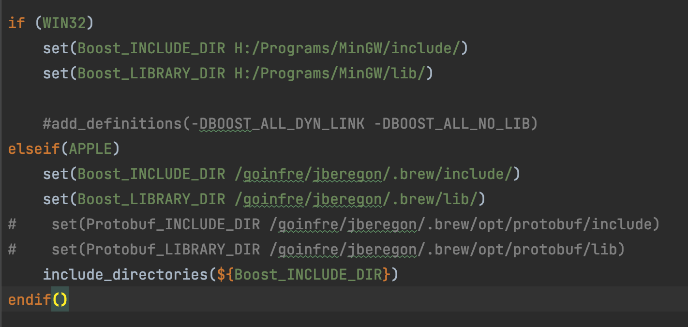
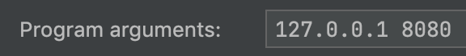
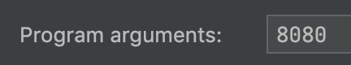
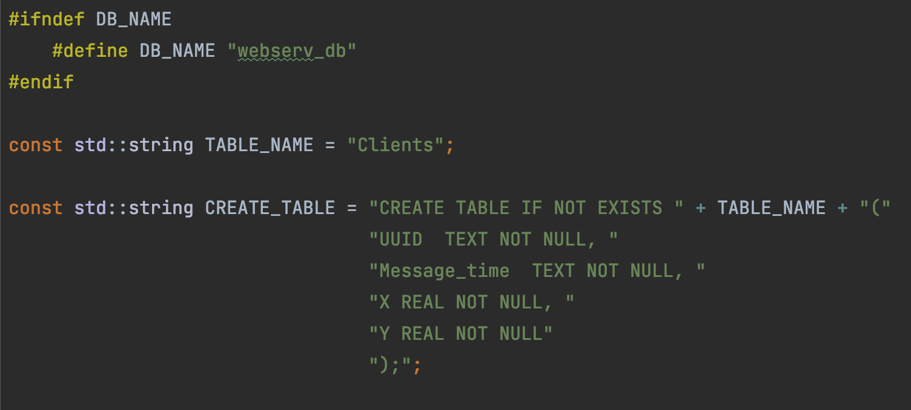

## Клиент-серверное приложение с хранением автогенерируемых данных в SqliteDB

## Инструкция по сборке:

#### 1) Настройте пути до вашей библиотеки ***boost*** в CMakeLists.txt файлах директорий client/ и server/ в зависимости от вашей операционной системы 
#### ОС: MacOS или Windows (работоспособность на Linux не проверена)

#### 2) Добавьте программные аргументы для клиента(айпи адрес и порт подключения) и сервера(порт прослушивания)

 

#### 3) В заголовочном файле /server/db.hpp Измените название базы данных и таблицы на ваше усмотрение и удобство

# О проекте:

### Реализованный функционал:
 - Клиент:
   - Генерация случайной задержки в диапазоне от 5 до 30 секунд
   - Генерация двух вещественных чисел в диапазоне от -90 до 90
   - Генерация текущего времени перед отправкой сообщения
   - Отправка сообщения сконструированого из вышеперечисленных пунктов серверу
 - Сервер:
   - Создание или подключение к базе данных Sqlite 
   - Поддержка подключения множества клиентов благодаря *_async методам 
   - Генерация UUID клиента для нового принятого соединения
   - Парсинг входных данных от клиента и сохранение информации в БД

### Не реализованный функционал:
 - Сервер:
   - Конструирование статистики входных данных каждого клиента из базы данных
 за промежуток времени(1 и 5 минут) - среднее значение столбца X и сумма значений
 по модулю столбца Y.
   - Сериализация запросов/ответов в protobuf

