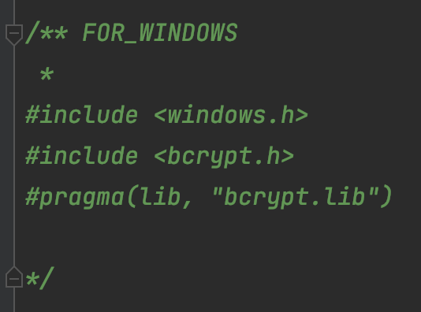

## Клиент-серверное приложение с хранением автогенерируемых данных в SqliteDB

# О проекте:

### Реализованный функционал:
- Клиент:
    - Генерация случайной задержки в диапазоне от 5 до 30 секунд
    - Генерация двух вещественных чисел в диапазоне от -90 до 90
    - Генерация текущего времени перед отправкой сообщения
    - Отправка сообщения сконструированого из вышеперечисленных пунктов серверу
    - Вывод в консоль ответного сообщения от сервера
    - Возможность запросить статистику у сервера с помощью запуска с аргументом "***--statistic***"
- Сервер:
    - Создание или подключение к базе данных Sqlite
    - Поддержка подключения множества клиентов благодаря *_async методам
    - Генерация UUID клиента для нового принятого соединения
    - Сериализация данных запросов/ответов c помощью ***protobuf*** в файл "data.bin"
    - Парсинг входных данных от клиента и сохранение полученной информации в БД Sqlite   (если это не запрос статистики и формат сообщения корректен)
    - Формирование сообщения статистики по запросу ***--statistic*** от клиента в формате: UUID X_1 Y_1 X_5 Y_5
      <ul>
          <li>UUID - Уникальный хэшированный ключ пользователя</li>
          <li>X_1 - Среднее значение столбца X пользователя за промежуток времени в 1 минуту </li>
          <li>Y_1 - Сумма дробной части значений столбца Y пользователя за промежуток времени в 1 минуту</li>
          <li>X_5 - Среднее значение столбца X пользователя за промежуток времени в 5 минут </li>
          <li>Y_5 - Сумма дробной части значений столбца Y пользователя за промежуток времени в 5 минут</li>
      </ul>
    
## Инструкция по сборке:

> ⚠️ Кроссплатформенная сборка на Windows и MacOS проверялась до внедрения сериализации  
> Если вы используете Windows проверьте корректность линковки проекта с вашей библиотекой ***protobuf***

#### 1) Измените пути до ваших библиотек ***boost*** и ***protobuf*** CMakeLists.txt файлах директорий client/ и server/ в зависимости от вашей операционной системы 
> ОС: MacOS или Windows ( ⚠️ работоспособность на Linux не проверена)

[//]: # (![CMAKE]&#40;./markdown_imgs/cmake.png&#41;)

### Дополнение для Windows:
>в файле server/main_header.hpp уберите комментарий этих строк:

[//]: # (![WIN]&#40;./markdown_imgs/win_help.png&#41;)

#### 2) В заголовочном файле /server/db.hpp Измените название базы данных и таблицы на ваше усмотрение и удобство

[//]: # (![DB_CNF]&#40;./markdown_imgs/db_img.png&#41;)

#### 3) Добавьте программные аргументы для клиента(127.0.0.1 и порт подключения) и сервера(порт прослушивания)

[//]: # (![ARG_0]&#40;./markdown_imgs/arg_1.png&#41; )

[//]: # ()
[//]: # (![ARG_1]&#40;./markdown_imgs/arg_0.png&#41;)

#### 4) JUST CLICK RUN!!!

## Дополнительная информация:
> 1) Для экономии времени вы можете переместить файл 'webserv_db' из корня проекта в папку server/cmake-build-debug/   
> для использования базы данных с большим объемом данных
> 2) Файл с сериализованными данными "data.bin" ищите в папке server/cmake-build-debug/